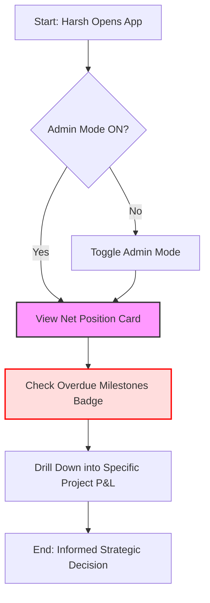
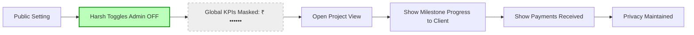
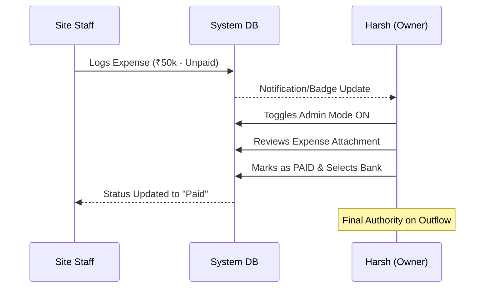
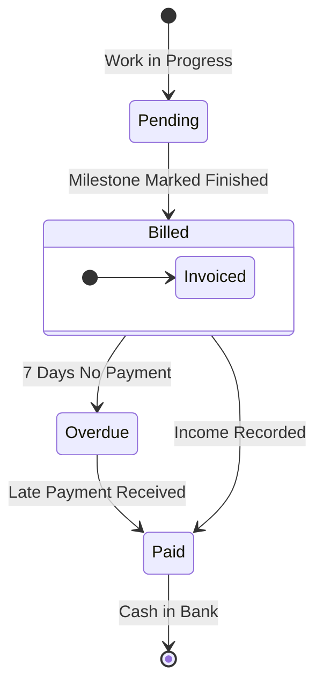
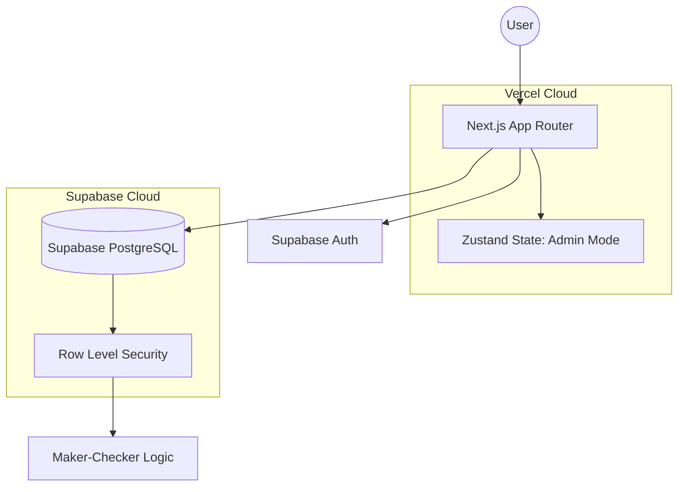

# 📊 Visual Journey Flows: Apex Buildcon Management System

These diagrams represent the core user experiences for **Harsh Jani** and his team.

---

## 1. The Morning Pulse (Admin Review)
Harsh checks the high-level financial health of Apex Buildcon.

---

## 2. The Privacy Shield (Site Visit)
Harsh visits a construction site and shows milestone progress to a client without revealing margins.

---

## 3. The Maker-Checker (Payment Cycle)
Ensuring that staff can enter bills, but only Harsh can authorize the actual cash outflow.

---

## 4. The Milestone Safety-Net (Revenue Tracking)
Tracking money from work completion to bank deposit.

---

## 5. Technical Architecture
The engine powering Apex Buildcon.

---
*Created for Apex Buildcon | Visualizing Operational Excellence*
